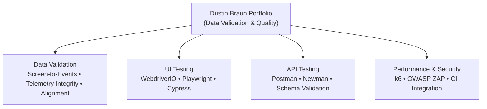

# 🔍 Dustin Braun  
## Data Validation Lead | Video Analytics & Platform Integrity
### Quality Engineering • Hardware-in-the-Loop Observability • AI Readiness

### Data-driven quality engineering: validating what users see against what telemetry claims, powered by explainable heuristics and evidence-backed findings.

---

## 🔥 Welcome

I engineer **data validation systems**, not just test scripts.

My work spans:
- **Data Quality:** Correlating ground truth (video) with telemetry claims  
- **Observability:** Hardware-in-the-loop testing & alignment  
- **Automation:** Modern testing frameworks with high signal, low noise  
- **Integrity:** Explainable heuristics over opaque magic  
- **Evidence:** Screenshot-backed findings with timestamps & confidence  

Every repository in this portfolio reflects **real engineering standards**, not classroom demos.

---

## 📦 Portfolio Architecture (Overview)

---

# 🧩 Portfolio Projects

## 📊 Project Matrix

| # | Project | Tech Stack | Key Capabilities | Links |
|---|---------|------------|------------------|-------|
| ⭐ | **Signal & Noise (Screen-to-Events)** *Hardware-in-the-loop observability* |     | • Video-derived state timeline • Telemetry correlation engine • Multi-device support (Roku/Apple TV) • Time alignment & drift estimation • Evidence-backed findings • S3/Athena/OpenSearch adapters | [Repo](https://github.com/jptrp/signal-noise-screen2events) |
| ⭐ | **ERP Test Automation** *Enterprise system showcase* |     | • MVP ERP (4 modules) • 190 TestRail test cases • Feature flags (A/B testing) • Dual CI/CD (AWS + Azure) • 90% automation | [Repo](https://github.com/jptrp/cypress-erp-test-automation) |
| ⭐ | **Video Data Quality Lab** *ML/AI testing framework* |    | • Computer vision testing • ML model validation • Video quality metrics • Automated analysis • Research-grade | [Repo](https://github.com/jptrp/video-data-quality-lab) |
| 4 | **WebdriverIO UI Automation** *Production framework* |    | • POM Architecture • 3 Test Suites (Smoke/Regression/E2E) • CI/CD + Allure Reports • ESLint/Prettier/Husky | [Repo](https://github.com/jptrp/saucedemo-wdio-automation) • [CI](https://github.com/jptrp/saucedemo-wdio-automation/actions) • [Reports](https://jptrp.github.io/saucedemo-wdio-automation/) |
| 5 | **API Testing** *Contract validation* |   | • 11-endpoint suite • JSON schema validation • Negative testing • CI-ready | [Repo](https://github.com/jptrp/saucedemo-api-testing-postman) |
| 6 | **Playwright UI** *Modern automation* |   | • Cross-browser testing • Trace viewer • Deterministic selectors • Fast execution | [Repo](https://github.com/jptrp/saucedemo-playwright) |
| 7 | **Cypress UI** *Developer experience* |   | • Fast dev cycles • Custom commands • Strong debugging • Time-travel debugging | [Repo](https://github.com/jptrp/cypress-ui-saucedemo-automation) |
| 8 | **Performance + Security** *Non-functional testing* |   | • Load testing with thresholds • ZAP baseline scanning • Combined perf + security • CI integration | [Repo](https://github.com/jptrp/k6-zap-perfsec-automation) |

### 🎯 What This Demonstrates

- **Data Validation & Observability** → Correlating ground truth (video) with telemetry claims, aligning timelines, detecting anomalies
- **Computer Vision & Video Analysis** → State detection, motion analysis, OCR-based signals, explainable heuristics
- **Telemetry Integrity** → Normalized adapters for S3, Athena, OpenSearch; session/device identity resolution
- **UI Automation Mastery** → 3 modern frameworks (WDIO, Playwright, Cypress) with POM architecture
- **API Testing Expertise** → Schema validation, contract testing, normalization pipelines
- **Non-Functional Testing** → Performance + Security (k6, OWASP ZAP) integrated with CI/CD
- **Production Standards** → Type-safe design (Pydantic, TypeScript), comprehensive docs, explainable heuristics

---

# 🧠 Engineering Philosophy

> **Data Validation & Automation are engineering disciplines.**

I operate by these principles:

- **Screen is Truth** → Video is ground truth, telemetry is claims to validate  
- **Explainability > Opaque Magic** → Deterministic heuristics over ML black boxes  
- **Evidence-Backed Findings** → Mismatches backed by screenshots, timestamps, confidence scores  
- **Stability > Speed**  
- **Clarity > Cleverness**  
- **Architecture > Accumulation**  
- **Real Coverage > Illusion of Tests**  

These tools aren't written to simulate production or automate clicks —  
they're written to **validate claims, detect anomalies, and improve decisions at scale**.

---

# 🛠️ Technical Skills

**Languages:** Python, TypeScript, JavaScript  
**Data Validation:** Pydantic, Video Processing, Computer Vision, State Machines, Correlation Engines  
**Telemetry Adapters:** S3, AWS Athena, OpenSearch, JSONL normalization  
**UI Automation:** WDIO, Playwright, Cypress, Selenium  
**API Testing:** Postman, Newman, Playwright API, schema validation  
**Performance & Security:** k6, OWASP ZAP  
**CI/CD:** GitHub Actions, Docker  
**Architecture:** POM, Adapters, Fixtures, Utilities, Data Strategies, Evidence Export  

---

# 📫 Contact

**Dustin Braun**  
Data Validation Lead | Video Analytics & Platform Integrity  
📍 Castle Rock, CO  
🔍 Focus: Telemetry Integrity, Hardware-in-the-Loop Observability, AI Readiness  
📧 jptrp@icloud.com  
🔗 https://www.linkedin.com/in/dustinbrauntesting/  
🐙 https://github.com/jptrp  

---

### *This portfolio represents how I think about quality, data integrity, reliability, and engineering — from validation systems to test automation.*

⭐ Star this repo if you'd like  
🔄 Updated: January 2026  

