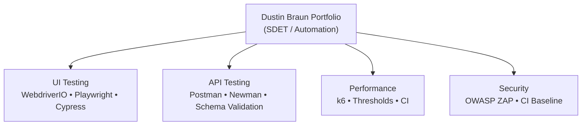

# 🏗️ Dustin Braun  
## Senior SDET / QA Automation Engineer Portfolio

### Senior-level automated testing frameworks built with modern engineering practices — designed for reliability, clarity, and velocity.

---

## 🔥 Welcome

I engineer **automation systems**, not scripts.

My frameworks are built for:
- High signal, low noise  
- CI/CD stability  
- Zero-flake execution  
- Fast iteration  
- Clean abstractions  
- Test strategy clarity  

Every repository in this portfolio reflects **real engineering standards**, not classroom demos.

---

## 📦 Portfolio Architecture (Overview)

```mermaid
flowchart TB
    A["Dustin Braun Portfolio<br/>(SDET / Automation)"]
    A --> B["UI Testing<br/>WebdriverIO • Playwright • Cypress"]
    A --> C["API Testing<br/>Postman • Newman • Schema Validation"]
    A --> D["Performance<br/>k6 • Thresholds • CI"]
    A --> E["Security<br/>OWASP ZAP • CI Baseline"]

    click B "https://github.com/jptrp/saucedemo-wdio-automation" "UI Automation (WDIO)"
    click C "https://github.com/jptrp/saucedemo-api-testing-postman" "API Testing (Postman)"
    click D "https://github.com/jptrp/k6-zap-perfsec-automation" "Performance (k6) + Security"
```

---

# 🧩 Portfolio Projects

## 📊 Project Matrix

| # | Project | Tech Stack | Key Capabilities | Links |
|---|---------|------------|------------------|-------|
| ⭐ | **WebdriverIO UI Automation** *Flagship framework* |    | • POM Architecture • 3 Test Suites (Smoke/Regression/E2E) • CI/CD + Allure Reports • ESLint/Prettier/Husky | [Repo](https://github.com/jptrp/saucedemo-wdio-automation) • [CI](https://github.com/jptrp/saucedemo-wdio-automation/actions) • [Reports](https://jptrp.github.io/saucedemo-wdio-automation/) |
| 2 | **API Testing** *Contract validation* |   | • 11-endpoint suite • JSON schema validation • Negative testing • CI-ready | [Repo](https://github.com/jptrp/saucedemo-api-testing-postman) |
| 3 | **Playwright UI** *Modern automation* |   | • Cross-browser testing • Trace viewer • Deterministic selectors • Fast execution | [Repo](https://github.com/jptrp/saucedemo-playwright) |
| 4 | **Cypress UI** *Developer experience* |   | • Fast dev cycles • Custom commands • Strong debugging • Time-travel debugging | [Repo](https://github.com/jptrp/cypress-ui-saucedemo-automation) |
| 5 | **Performance + Security** *Non-functional testing* |   | • Load testing with thresholds • ZAP baseline scanning • Combined perf + security • CI integration | [Repo](https://github.com/jptrp/k6-zap-perfsec-automation) |

### 🎯 What This Demonstrates

- **UI Automation Mastery** → 3 modern frameworks (WDIO, Playwright, Cypress)
- **API Testing Expertise** → Schema validation, contract testing, CI/CD
- **Non-Functional Testing** → Performance + Security (rare SDET skill)
- **Framework Design** → POM, utilities, clean abstractions
- **CI/CD Engineering** → GitHub Actions, reporting, automation pipelines
- **Production Standards** → ESLint, Prettier, TypeScript, comprehensive docs

---

# 🧠 Automation Philosophy

> **Automation is an engineering discipline.**

I operate by these principles:

- **Stability > Speed**  
- **Clarity > Cleverness**  
- **Architecture > Accumulation**  
- **Truth in CI > Beauty in IDE**  
- **Real Coverage > Illusion of Tests**

Automation isn't written to simulate production —  
it's written to **improve decisions and reduce risk**.

---

# 🛠️ Technical Skills

**Languages:** TS, JS, Python  
**UI Automation:** WDIO, Playwright, Cypress, Selenium  
**API Testing:** Postman, Newman, Playwright API  
**Performance:** k6  
**Security:** OWASP ZAP  
**CI/CD:** GitHub Actions, Docker  
**Architecture:** POM, Fixtures, Utilities, Data Strategies  

---

# 📫 Contact

**Dustin Braun**  
Senior SDET / QA Automation Engineer  
📍 Castle Rock, CO  
📧 jptrp@icloud.com  
🔗 https://www.linkedin.com/in/dustinbrauntesting/  
🐙 https://github.com/jptrp  

---

### *This portfolio represents how I think about quality, reliability, and engineering — not just how I write tests.*

⭐ Star this repo if you'd like  
🔄 Updated: November 2025  

