# 🏗️ Dustin Braun  
## Senior SDET / QA Automation Engineer Portfolio

### Senior-level automated testing frameworks built with modern engineering practices — designed for reliability, clarity, and velocity.

---

## 🔥 Welcome

I engineer **automation systems**, not scripts.

My frameworks are built for:
- High signal, low noise  
- CI/CD stability  
- Zero-flake execution  
- Fast iteration  
- Clean abstractions  
- Test strategy clarity  

Every repository in this portfolio reflects **real engineering standards**, not classroom demos.

---

## 📦 Portfolio Architecture (Overview)

```mermaid
flowchart TB
    A["Dustin Braun Portfolio<br/>(SDET / Automation)"]
    A --> B["UI Testing<br/>WebdriverIO • Playwright • Cypress"]
    A --> C["API Testing<br/>Postman • Newman • Schema Validation"]
    A --> D["Performance<br/>k6 • Thresholds • CI"]
    A --> E["Security<br/>OWASP ZAP • CI Baseline"]

    click B "https://github.com/jptrp/saucedemo-wdio-automation" "UI Automation (WDIO)"
    click C "https://github.com/jptrp/saucedemo-api-testing-postman" "API Testing (Postman)"
    click D "https://github.com/jptrp/k6-zap-perfsec-automation" "Performance (k6) + Security"
```

---

# 🧩 Portfolio Projects (Curated — 5 Repos)

---

## 1️⃣ WebdriverIO + TypeScript — UI Automation (Flagship)
🔗 https://github.com/jptrp/saucedemo-wdio-automation  

**Badges:**  
  

**Highlights**
- Clean **POM architecture**
- Smoke, Regression & E2E suites  
- Custom utilities (waits, helpers, logger)
- ESLint, Prettier, Husky  
- Allure reporting (GitHub Pages)
- Screenshots on failure
- Chrome headless CI via GitHub Actions  

> Demonstrates senior-level automation framework ownership.

---

## 2️⃣ API Testing — Postman + Newman
🔗 https://github.com/jptrp/saucedemo-api-testing-postman  

Badges:  

**Highlights**
- 11-endpoint suite  
- JSON schema validation  
- Token chaining  
- Negative testing  
- CI-ready design  

> Demonstrates API test strategy and contract validation.

---

## 3️⃣ Playwright UI Automation
🔗 https://github.com/jptrp/saucedemo-playwright  

Badges:  

**Highlights**
- Modern cross-browser tests  
- Trace viewer, screenshots  
- Deterministic selectors  
- Fast execution  

> Demonstrates mastery of modern UI frameworks.

---

## 4️⃣ Cypress UI Automation
🔗 https://github.com/jptrp/cypress-ui-saucedemo-automation  

Badges:  

**Highlights**
- Fast dev cycles  
- Custom commands  
- Solid debugging surface  

> Demonstrates breadth across multiple automation stacks.

---

## 5️⃣ Performance + Security Testing (k6 + OWASP ZAP)
🔗 https://github.com/jptrp/k6-zap-perfsec-automation  

Badges:  

**Highlights**
- Load tests with thresholds  
- ZAP baseline scan  
- Combined perf + security workflows  

> Demonstrates non-functional testing — a rare SDET differentiator.

---

# 🧠 Automation Philosophy

> **Automation is an engineering discipline.**

I operate by these principles:

- **Stability > Speed**  
- **Clarity > Cleverness**  
- **Architecture > Accumulation**  
- **Truth in CI > Beauty in IDE**  
- **Real Coverage > Illusion of Tests**

Automation isn't written to simulate production —  
it's written to **improve decisions and reduce risk**.

---

# 🛠️ Technical Skills

**Languages:** TS, JS, Python  
**UI Automation:** WDIO, Playwright, Cypress, Selenium  
**API Testing:** Postman, Newman, Playwright API  
**Performance:** k6  
**Security:** OWASP ZAP  
**CI/CD:** GitHub Actions, Docker  
**Architecture:** POM, Fixtures, Utilities, Data Strategies  

---

# 📫 Contact

**Dustin Braun**  
Senior SDET / QA Automation Engineer  
📍 Castle Rock, CO  
📧 jptrp@icloud.com  
🔗 https://www.linkedin.com/in/dustinbrauntesting/  
🐙 https://github.com/jptrp  

---

### *This portfolio represents how I think about quality, reliability, and engineering — not just how I write tests.*

⭐ Star this repo if you'd like  
🔄 Updated: November 2025  

